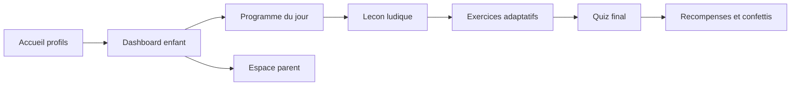

# Maquettes fonctionnelles

## Flux principal

## Ecran 1: Accueil profils

- Header avec mascotte et slogan motivant.
- Deux grosses cartes cliquables: Enfant 1, Enfant 2.
- Apercu rapide: niveau, XP, streak, dernier badge.

## Ecran 2: Dashboard enfant

- Hero avec avatar + progression hebdo.
- Cartes matieres: Maths, Conjugaison, Grammaire, Orthographe, Calcul mental.
- Bloc Programme du jour (20 min).
- Coffre du jour / recompense potentielle.

## Ecran 3: Session 20 minutes

- Timeline visuelle: 3 min revision, 7 min lecon, 8 min exercices, 2 min quiz.
- Messages encouragements positifs.
- Boutons larges, code couleur par phase.

## Ecran 4: Espace parent

- KPIs: temps passe, notions maitrisees, notions a revoir.
- Historique des 7 derniers jours.
- Recommandations pedagogiques automatiques.
